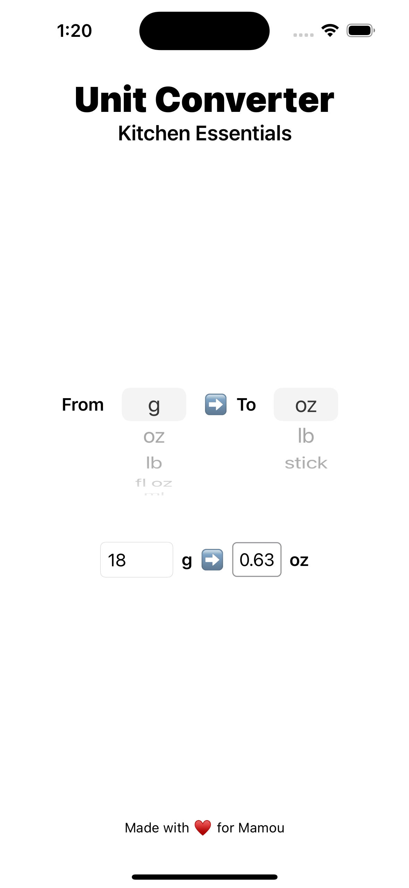
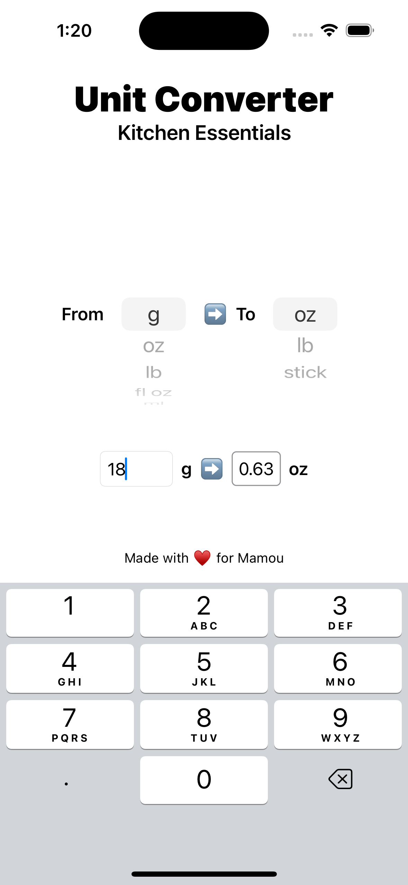
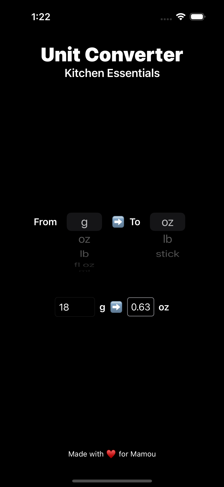
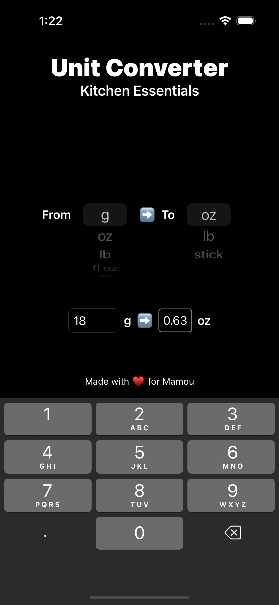

# Kitchen Converter
Simple IOS app to help with converting between various mass, volume and temperature units that are commonly used in the kitchen.

# Screenshots

<h2 style="text-align: center;">Light Mode</h2>

  
   

<h2 style="text-align: center;">Dark Mode</h2>

  
   

